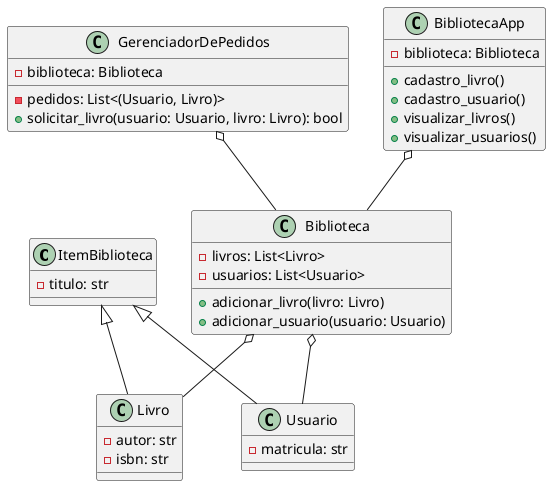

# **Bibliotech: O Futuro da Gestão de Livros em Python**💻

## Índice🐈‍⬛
1. [Introdução](#introdução)
2. [Diagrama UML](#diagrama-uml)
3. [Documentação das Classes e Métodos](#documentação-das-classes-e-métodos)
4. [Descrição das Funcionalidades](#descrição-das-funcionalidades)
5. [Roadmap de Execução](#roadmap-de-execução)
6. [Manual de Instalação e Uso](#manual-de-instalação-e-uso)

## Introdução🗒️

Este projeto, **Bibliotech**, é um sistema simples de gerenciamento de bibliotecas implementado em Python. Ele oferece uma interface gráfica criada com `tkinter` para o cadastro de livros, usuários e a gestão de pedidos. Além disso, o código é organizado de forma orientada a objetos, facilitando a manutenção e a expansão do software.

## Diagrama UML📊

O diagrama UML abaixo representa a estrutura das classes e suas relações no sistema:



## Documentação das Classes e Métodos

### Classe: `ItemBiblioteca`
- **Atributos:**
  - `titulo`: O título do item na biblioteca.
- **Descrição:** Classe base que representa um item genérico na biblioteca. Serve como base para herança das classes `Livro` e `Usuario`.

### Classe: `Livro`
- **Atributos:**
  - `titulo`: O título do livro.
  - `autor`: O autor do livro.
  - `isbn`: O ISBN do livro.
- **Descrição:** Herda de `ItemBiblioteca`. Representa um livro na biblioteca com informações adicionais, como autor e ISBN.

### Classe: `Usuario`
- **Atributos:**
  - `titulo`: O nome do usuário.
  - `matricula`: A matrícula do usuário.
- **Descrição:** Herda de `ItemBiblioteca`. Representa um usuário da biblioteca, identificado por nome e matrícula.

### Classe: `Biblioteca`
- **Atributos:**
  - `livros`: Lista de livros disponíveis na biblioteca.
  - `usuarios`: Lista de usuários cadastrados.
- **Métodos:**
  - `adicionar_livro(livro)`: Adiciona um livro à biblioteca.
  - `adicionar_usuario(usuario)`: Adiciona um usuário à biblioteca.
- **Descrição:** Gerencia os dados da biblioteca, armazenando livros e usuários.

### Classe: `GerenciadorDePedidos`
- **Atributos:**
  - `biblioteca`: Instância da classe `Biblioteca`.
  - `pedidos`: Lista de pedidos de livros realizados.
- **Métodos:**
  - `solicitar_livro(usuario, livro)`: Adiciona um pedido de livro, verificando se o livro está disponível.
- **Descrição:** Gerencia os pedidos de empréstimo de livros, verificando se o livro solicitado está disponível na biblioteca.

### Classe: `BibliotecaApp`
- **Atributos:**
  - `biblioteca`: Instância da classe `Biblioteca`.
- **Métodos:**
  - `cadastro_livro()`: Abre a tela de cadastro de livros.
  - `cadastro_usuario()`: Abre a tela de cadastro de usuários.
  - `visualizar_livros()`: Abre a tela de visualização de livros cadastrados.
  - `visualizar_usuarios()`: Abre a tela de visualização de usuários cadastrados.
  - `voltar(frame)`: Retorna à tela principal do aplicativo.
- **Descrição:** Implementa a interface gráfica do programa e gerencia a navegação entre as telas.

## Descrição das Funcionalidades

1. **Cadastro de Livros:**
   - Permite ao usuário inserir o título, autor e ISBN de um novo livro.
   - O livro é armazenado na biblioteca para futuros pedidos.

2. **Cadastro de Usuários:**
   - Permite cadastrar um novo usuário na biblioteca inserindo nome e matrícula.
   - O usuário pode ser usado para realizar pedidos de livros.

3. **Visualização de Livros:**
   - Exibe a lista de todos os livros cadastrados na biblioteca, mostrando título, autor e ISBN.

4. **Visualização de Usuários:**
   - Exibe a lista de todos os usuários cadastrados, mostrando nome e matrícula.

5. **Gerenciamento de Pedidos:**
   - Usuários podem solicitar livros disponíveis na biblioteca.
   - O sistema verifica se o livro está disponível antes de confirmar o pedido.

## Roadmap de Execução🗺️

1. **Inicialização do Programa:**
   - O programa começa instanciando a classe `BibliotecaApp`, que inicializa a interface gráfica com as opções principais de cadastro e visualização.

2. **Cadastro de Livros e Usuários:**
   - Ao escolher uma opção de cadastro, a tela correspondente é exibida. O usuário preenche os campos necessários e, ao clicar em "Salvar", o livro ou usuário é adicionado à lista correspondente.

3. **Visualização de Livros e Usuários:**
   - Ao clicar em "Visualizar Livros" ou "Visualizar Usuários", a tela exibe uma lista de todos os itens cadastrados na biblioteca.

4. **Gerenciamento de Pedidos:**
   - Embora o código principal não inclua uma interface para pedidos de livros, a classe `GerenciadorDePedidos` pode ser chamada para gerenciar solicitações, verificando se o livro está disponível na biblioteca.

5. **Finalização:**
   - O programa continua rodando até que o usuário feche a janela principal, encerrando a aplicação.

## Manual de Instalação e Uso

### Dependências

Para rodar o projeto, você precisa ter o Python instalado, além da biblioteca `tkinter` (que geralmente já vem incluída nas distribuições padrão do Python).

### Instalação

Se por algum motivo `tkinter` não estiver instalado, você pode instalá-lo com o seguinte comando:

```bash
sudo apt-get install python-tk
```

### Inicialização💻

1. **Clone o repositório:**

   ```bash
   git clone https://github.com/joaoportolan93/bibliotech.git
   cd bibliotech
   ```

2. **Execute o programa:**

   No terminal, navegue até o diretório do projeto e execute o arquivo principal:

   ```bash
   python bibliotech.py
   ```

### Uso⌨️

- **Tela Principal:**
  - Escolha entre cadastrar livros, cadastrar usuários ou visualizar os itens já cadastrados.

- **Cadastro de Livros:**
  - Insira o título, autor e ISBN do livro e clique em "Salvar" para adicioná-lo à biblioteca.

- **Cadastro de Usuários:**
  - Insira o nome e a matrícula do usuário e clique em "Salvar" para cadastrá-lo.

- **Visualização:**
  - Veja todos os livros ou usuários cadastrados, com opções para voltar à tela principal.

---

Esse README serve como uma documentação completa para o projeto, cobrindo desde a arquitetura do sistema até o uso final. Se precisar de mais alguma coisa ou ajustes, estou à disposição!

